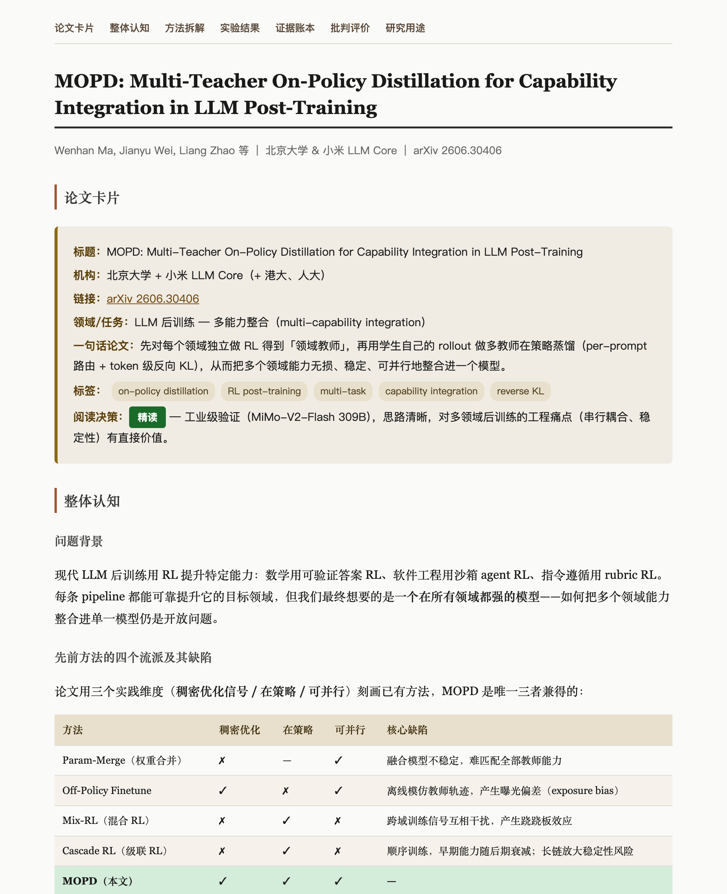
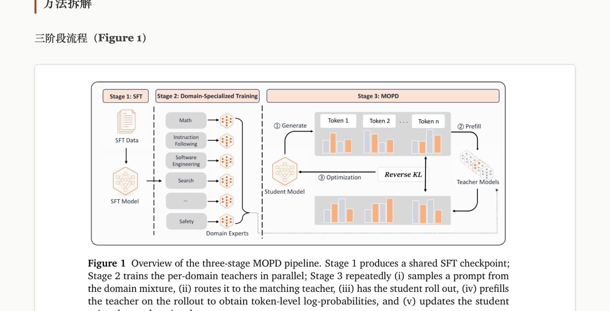

# mli-paper-reading-skill

> 把「读完一篇论文」变成「理解、批判、能复现一篇论文」——一个基于李沐论文精读方法的 AI 论文阅读 skill，适用于 Claude Code 和 Codex。

大多数 AI 读论文的方式是「从头到尾复述一遍」，结果是一份又长又平、看完等于没看的摘要。这个 skill 换一种读法：**先决定值不值得读，再按合适的深度读，最后把论文拆成一条可被质疑的论证链**，并产出一份图文并茂、可长期复用的 HTML 阅读笔记。

## 为什么用这套方法论

方法论来自李沐的论文精读系列（快速筛选 + 三遍阅读 + 逐段精读）与 Keshav 的《How to Read a Paper》。相比「让 AI 总结一下这篇论文」，它有四个本质区别：

### 1. 先筛选，不浪费深度在不值得的论文上

不是一上来就逐段读，而是先读标题、摘要、引言、结论、图表，产出一张 **Paper Card**（问题 / 贡献 / 证据类型 / 是否继续），给出明确的**精读 / 略读 / 跳过**决策。读的深度匹配论文的价值。

### 2. 三遍阅读，深度递进而非一次铺平

| 遍数 | 目标 | 产出 |
|---|---|---|
| **Pass 1** | 建立整体图像 | 一句话论文 + 读/跳决策 |
| **Pass 2** | 梳理内容与证据 | 方法图、核心贡献、证据梳理 |
| **Pass 3** | 虚拟复现 | 重建假设/公式/伪代码、复现风险、缺失细节 |

越重要的论文读得越深，普通论文停在 Pass 1/2 即可，避免把精力平均浪费。

### 3. 把论文读成「论证链」，而不是「章节摘要」

追踪 **问题 → 主张 → 理由 → 证据 → 局限** 的完整链条。对每个主要主张都追问：哪个结果支撑它？基线公平吗？隐含了什么假设？什么会改变你的判断？——最终产出一张 **证据账本**，逐条标注每个主张的证据强度（强 / 弱 / 不足）和待验证项。这是普通摘要完全给不出的东西。

### 4. 产出可复用的研究资产，而不是一次性对话

读完自动生成一份**自包含 HTML 笔记**：

- **嵌入论文原图** —— 从 PDF 精确提取图表并 base64 内嵌，公式截断、乱码等常见问题都已处理，笔记离线可用、可长期归档
- **MathJax 公式渲染** —— LaTeX 原样呈现，不再是终端里的乱码
- **结构化章节** —— 论文卡片 / 整体认知 / 方法拆解 / 实验结果 / 证据账本 / 批判评价 / 研究用途
- **读后追问菜单** —— 引导继续深挖：方法逐公式拆解、实验审查、复现清单、多论文对比、研究方向

---

## Demo：精读 DeepSeek/小米 MOPD 论文

以 [MOPD: Multi-Teacher On-Policy Distillation](https://arxiv.org/abs/2606.30406)（北大 + 小米，LLM 多能力整合）为例，一条命令生成的阅读笔记：

```
/mli-paper-reading 帮我精读这篇论文: https://arxiv.org/pdf/2606.30406
```

**笔记顶部**：粘性导航 + 论文卡片（含阅读决策）+ 方法对比表——一眼看清论文在设计空间中的定位。



**方法拆解**：论文原图（Figure 1）直接内嵌，配合逐段分析与 MathJax 公式，图文对照。



笔记还包含完整的**证据账本**（逐条标注 7 个主张的证据强度与待验证项）和**批判性评价**（优缺点、隐含假设、复现风险），此处不再截图。

---

## 安装

### Claude Code（推荐）

```bash
claude plugin marketplace add PengheLiu/mli-paper-reading-skill
claude plugin install mli-paper-reading-skill@mli-paper-reading-skill
```

安装后新开一个 Claude Code 会话即可使用。

### Codex / 手动安装

```bash
git clone https://github.com/PengheLiu/mli-paper-reading-skill
cd mli-paper-reading-skill
./scripts/install.sh          # 同时安装到 Codex 和 Claude Code
./scripts/install.sh --claude # 仅 Claude Code
./scripts/install.sh --codex  # 仅 Codex
./scripts/install.sh --link   # 用软链，改源文件后立即生效
```

默认安装路径：

| 平台 | 路径 |
|---|---|
| Claude Code | `~/.claude/skills/mli-paper-reading` |
| Codex | `~/.codex/skills/mli-paper-reading` |

## 使用

```
# Claude Code
/mli-paper-reading 帮我精读这篇论文: https://arxiv.org/abs/1706.03762
/mli-paper-reading 比较这几篇论文的贡献、实验设计和可复现性

# Codex
$mli-paper-reading 帮我精读这篇论文: https://arxiv.org/abs/1706.03762
```

支持输入格式：arXiv 链接、PDF 链接、DOI、本地 PDF 路径、论文标题。

生成的笔记默认在 `~/paper-notes/`，用 Python 内置 `http.server` 起本地服务并自动打开浏览器。停止服务：

```bash
kill $(cat /tmp/paper-notes-server.pid)
```

## 依赖

唯一需要手动安装的包：

```bash
python3 -m pip install pymupdf --user
```

其余依赖（Python 3.7+、`http.server`、`lsof`、`curl`、`open`）在 macOS 上均为系统内置。详见 `skills/mli-paper-reading/SKILL.md` 的 Dependencies 节，包含一键自检脚本。

## 仓库结构

```
mli-paper-reading-skill/
├── .claude-plugin/
│   ├── plugin.json          # Claude Code 插件元数据
│   └── marketplace.json     # 允许本仓库作为独立 marketplace
├── skills/
│   └── mli-paper-reading/   # Skill 核心目录（Claude Code & Codex 通用）
│       ├── SKILL.md         # 触发描述 + 完整工作流
│       ├── references/
│       │   └── li-mu-method.md   # 三遍读法参考、输出模板
│       └── agents/
│           └── openai.yaml  # Codex UI 元数据
├── docs/                    # README 配图
├── scripts/
│   └── install.sh           # 手动安装脚本
└── README.md
```

## 验证

```bash
bash -n scripts/install.sh

VALIDATOR="$HOME/.codex/skills/.system/skill-creator/scripts/quick_validate.py"
[ -f "$VALIDATOR" ] && python3 "$VALIDATOR" skills/mli-paper-reading \
  || echo "Codex validator not found, skipping"
```
